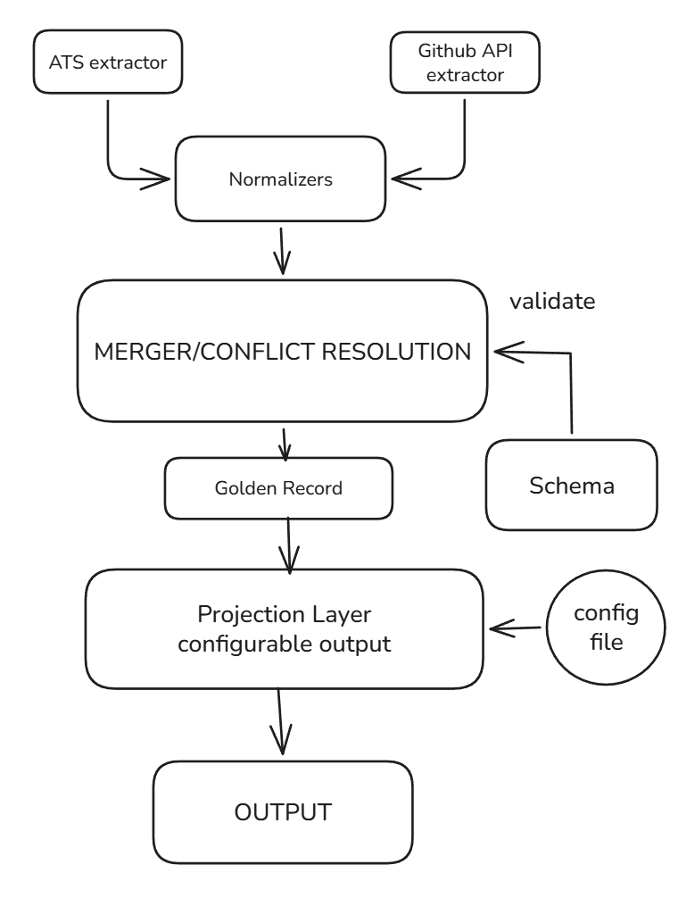

# Golden Record Engine — Multi-Source Candidate Data Transformer

A pipeline that ingests candidate data from an ATS JSON blob (structured) and a live GitHub profile (unstructured), resolves conflicts between them using a weighted scoring policy, and outputs either a full canonical Golden Record or a custom-shaped JSON via a runtime config.

---

## Setup 

**1. Clone the repo**
```bash
git clone https://github.com/praneel08/golden-record-engine.git
cd golden-record-engine
```
**(Optional) Create a virtual environment first:**

Windows:
```bash
python -m venv venv
venv\Scripts\activate
```

Mac/Linux:
```bash
python -m venv venv
source venv/bin/activate
```

Then continue with `pip install -r requirements.txt` as normal.

**2. Install dependencies**
```bash
pip install -r requirements.txt
```

**3. Run any command below**

---

## Test 1 — Jonathan Doe (ATS) + torvalds (GitHub)

### MODE 1 — ATS extractor only
Runs the ATS extractor alone — tests field-mapping and normalization on a structured source.
```bash
python main.py --ats data/ats_sample.json
```

### MODE 2 — GitHub extractor only
Runs the GitHub extractor alone — tests live API integration and normalization on an unstructured source.
```bash
python main.py --github torvalds
```

### MODE 3 — Merged Golden Record
Runs both extractors and merges them — tests the full conflict-resolution engine, provenance, and confidence scoring.
```bash
python main.py --ats data/ats_sample.json --github torvalds
```

### MODE 4 — Configurable projection
Runs the full merge then reshapes it via a config — tests the configurable projection layer (rename, normalize, confidence/provenance toggle).
```bash
python main.py --ats data/ats_sample.json --github torvalds --config configs/config_torvalds_example.json
```

---

## Test 2 — Sindre Sorhus (ATS) + sindresorhus (GitHub)

Get the merged record from ATS and GitHub — tests for handling duplicate skills in different sources.
```bash
python main.py --ats data/ats_sindre.json --github sindresorhus
```

### Configurable output

Test for null values on missing output — confirms a missing field (LinkedIn URL) is kept in output as `null` instead of crashing or disappearing.
```bash
python main.py --ats data/ats_sindre.json --github sindresorhus --config configs/config_null.json
```

Test for omitting fields with missing values — confirms a missing field is dropped entirely from the output JSON.
```bash
python main.py --ats data/ats_sindre.json --github sindresorhus --config configs/config_omit.json
```

Test for reporting error on not finding a required field.
```bash
python main.py --ats data/ats_sindre.json --github sindresorhus --config configs/config_error.json
```

---

## Test 3 — Andrej Karpathy (ATS) + karpathy (GitHub)

Tests robustness against malformed/garbage/null input.

The ATS blob deliberately contains a garbage date and a null education field.
```bash
python main.py --ats data/ats_karpathy.json --github karpathy
```

Tests configurable outputs with complex querying like array slicing and nested field renaming, plus the full confidence and provenance audit trail.
```bash
python main.py --ats data/ats_karpathy.json --github karpathy --config configs/config_karpathy.json
```
## Architecture


## Canonical Output Schema

| Canonical Field Path | Normalization / Validation Standard |
|---------------------|-------------------------------------|
| `candidate_id` | Truncated 12-char MD5 hash of primary email |
| `full_name` \| `headline` | Whitespace trimmed; "N/A" strings zeroed out |
| `emails[]` \| `phones[]` | Lowercased emails; E.164 phone format constraint |
| `location` | Country code forced to ISO-3166 alpha-2 (caps) |
| `links` | URL strings parsed and isolated by domain |
| `years_experience` | Non-negative values; fallback to GitHub account age |
| `skills[]` | Lowercased, alphanumeric, version-stripped tokens |
| `experience[]` \| `education[]` | All internal date tokens formatted strictly to YYYY-MM |
| `provenance[]` \| `overall_confidence` | Audited field histories; mean of active metrics |

## Merge Engine & Conflict Resolution

### 1. Core Scoring
Every valid piece of data earns a final confidence score ($S_{final}$) based on how much we trust its source, plus a bonus if it passes strict validation checks.

* Formula:
$$S_{final} = \min(1.0, W_{base} + B_{format})$$
* Base Weights ($W_{base}$): ATS = 0.75, GitHub = 0.60.
* Format Bonuses ($B_{format}$): Clean data is rewarded: E.164 Phone (+0.15), Email (+0.10), ISO-2 Country / YYYY-MM Date (+0.08).
* Garbage Penalty: Null, empty, or "N/A" values are instantly zeroed out ($S_{final} = 0.0$).

### 2. Single-Value Survivorship (Conflict Resolution)
When sources disagree on a field that can only have one true answer (like a candidate's name or country), the engine simply picks the value with the highest mathematical proof of quality.

* Logic:
$$Winner = \max(S_{ats}, S_{github})$$
* Tie-Breaker: In the event of a mathematical tie, the system defaults to the structured, formal ATS data.

### 3. Multi-Value Deduplication (Array Merging)
For lists (like skills), the engine combines everything into one master list. Unique skills keep their original $S_{final}$. However, if a skill is verified by both sources, it receives a cross-validation boost:

* Confidence Boost:
$$S_{boosted} = \min(1.0, \max(S_{ats}, S_{github}) + 0.1)$$

### 4. Deterministic Identity (Candidate Identification)
To ensure stable tracking across systems without relying on external databases, the pipeline assigns a unique, reproducible identifier to every merged profile.

* Logic: The `candidate_id` is generated as a truncated 12-character MD5 hash of the candidate's primary email.
* Fallback: If no email exists, the engine hashes their lowercase full name instead.